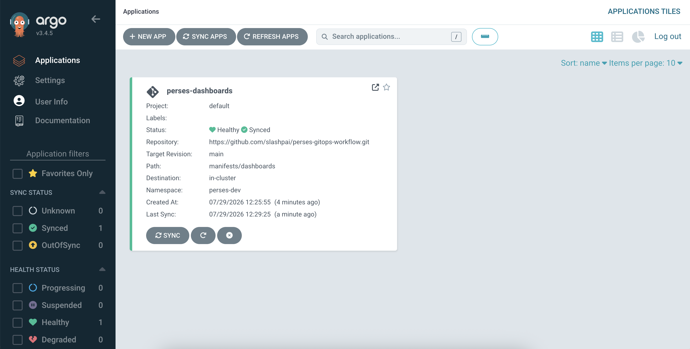
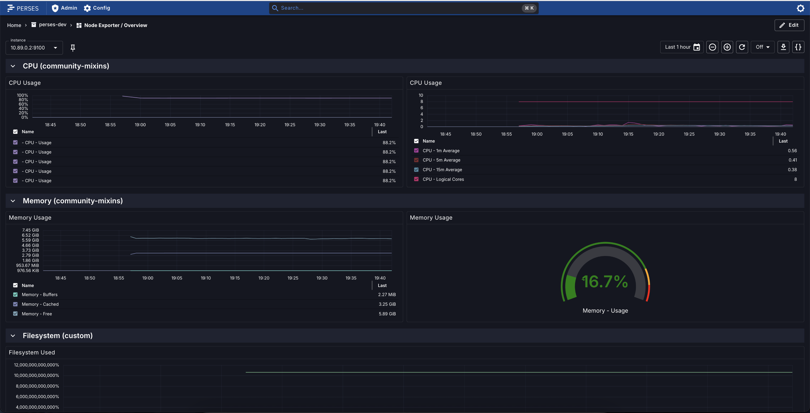

# Perses dashboard-as-code (GitOps example)

Author dashboards in Go, validate PromQL before render, generate `PersesDashboard` CRs, then deploy with kubectl or Argo CD. The YAML under `manifests/dashboards/` is the **delivery artifact** — source of truth is `dashboards/`.

1. **Author** in Go (`dashboards/`) with the [Perses Go SDK](https://github.com/perses/perses) and [promql-builder](https://github.com/perses/promql-builder)
2. **Validate** — `promqlbuilder.Validate` / `equalRegexp` catch bad PromQL on the Go path
3. **Render** `PersesDashboard` CRs (`make render-dashboards`)
4. **Commit** manifests under `manifests/dashboards/`
5. **Sync** with Argo CD (or `kubectl apply`) → [perses-operator](https://github.com/perses/perses-operator) reconciles

## Quick start

```sh
# After changing dashboards/ (Go 1.26+)
make validate-dashboards
make render-dashboards

# kind + cert-manager, operator, minimal kube-prometheus, Perses (perses-dev)
make setup-prerequisites

# Argo CD → sync manifests/dashboards (push main first; prompts for fork repoURL)
make setup-argocd

# Tear down stack (or delete the kind cluster)
make cleanup
```

Non-interactive:

```sh
YES=true CLUSTER_NAME=perses-demo make setup-prerequisites
YES=true REPO_URL=https://github.com/<you>/perses-gitops-workflow.git make setup-argocd
YES=true CLUSTER_NAME=perses-demo DELETE_KIND_CLUSTER=true make cleanup
```

## Deploy

```sh
# Direct apply (no Argo CD)
kubectl apply -f manifests/dashboards/

# Or GitOps
make setup-argocd

# Perses UI
kubectl -n perses-dev port-forward svc/perses-sample 8080:8080
```



**Node Exporter / Nodes** (CPU, load, memory, network).



## CI

`make validate-dashboards` → `make render-dashboards` → fail if `manifests/dashboards/` drifts.

## Troubleshooting

### DNS timeouts (`lookup … i/o timeout`) on kind + Podman

Intermittent ClusterIP/DNS issues are common with kind on Podman (especially with multiple clusters). Prefer one cluster; recreate with `make cleanup` / `make setup-prerequisites` if CoreDNS stays broken.

## Note

`dashboards/go.mod` temporarily `replace`s promql-builder with [`slashpai/promql-builder`](https://github.com/slashpai/promql-builder) until [perses/promql-builder#53](https://github.com/perses/promql-builder/pull/53) lands.

## Related

- [perses-operator](https://github.com/perses/perses-operator)
- [perses-operator-examples](https://github.com/slashpai/perses-operator-examples)
- [promql-builder](https://github.com/perses/promql-builder)
- [community-mixins](https://github.com/perses/community-mixins)

## License

MIT — see [LICENSE](LICENSE).
