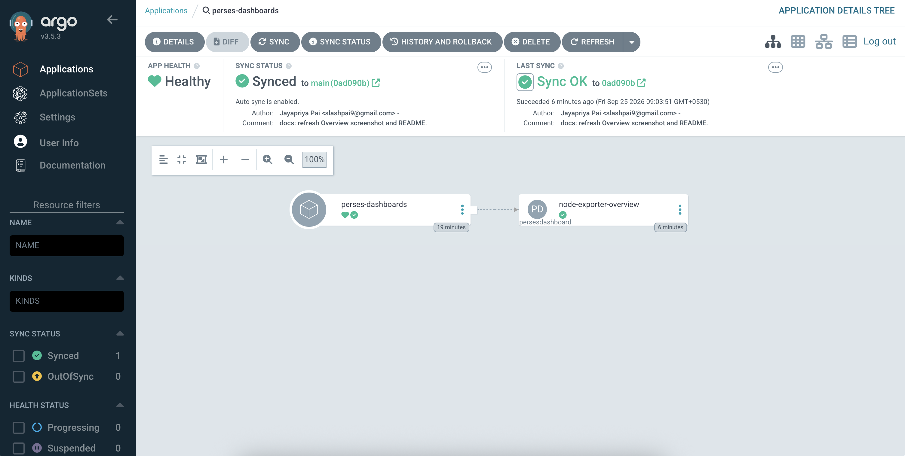
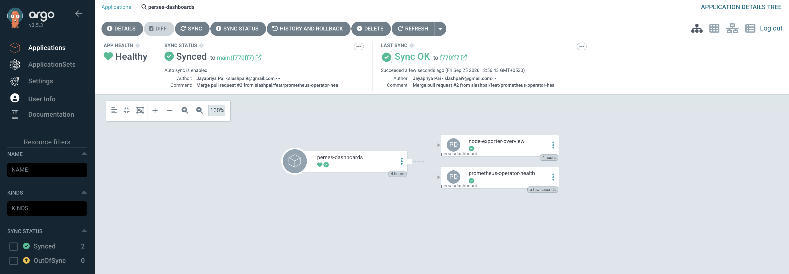
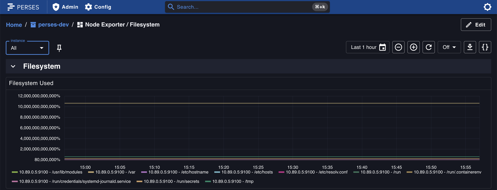
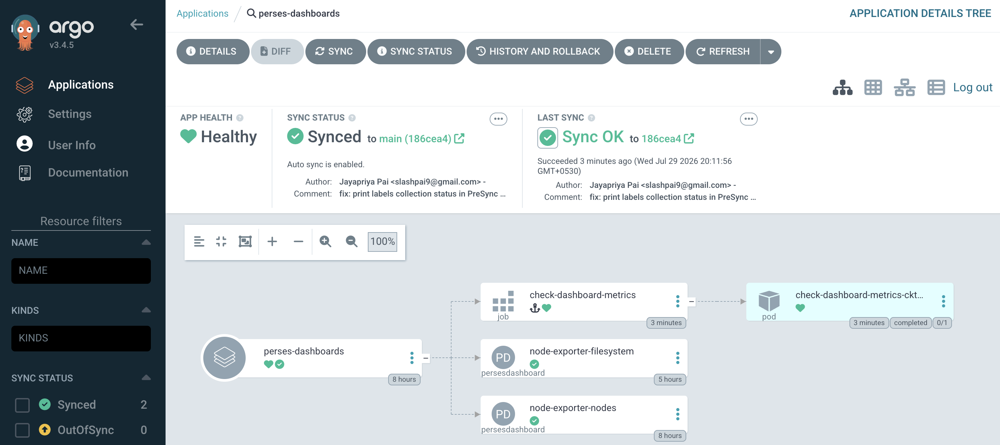
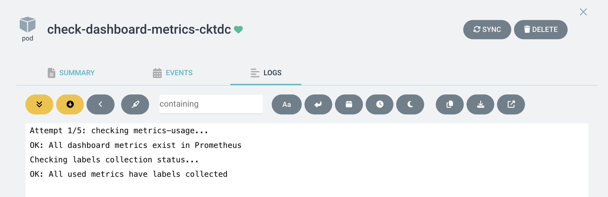

# Perses dashboard-as-code (GitOps example)

Author dashboards in Go, validate PromQL at build time, verify metrics and labels against a live Prometheus, generate `PersesDashboard` CRs, and deploy with Argo CD. The YAML under `manifests/dashboards/` is the **delivery artifact** — source of truth is `dashboards/`.

1. **Author** in Go (`dashboards/`) with the [Perses Go SDK](https://github.com/perses/perses) and [promql-builder](https://github.com/perses/promql-builder)
2. **Validate** — structural PromQL checks at build time (`promqlbuilder.Validate`)
3. **Render** `PersesDashboard` CRs (`make render-dashboards`)
4. **Verify** — semantic checks against live Prometheus via [metrics-usage](https://github.com/perses/metrics-usage) (`make check-metrics`, `make check-labels`)
5. **Commit** manifests under `manifests/dashboards/`
6. **Sync** with Argo CD (or `kubectl apply`) → PreSync hook gates deploy, [perses-operator](https://github.com/perses/perses-operator) reconciles

## Quick start

```sh
# After changing dashboards/ (Go 1.26+)
make validate-dashboards
make render-dashboards

# kind + cert-manager, operator, minimal kube-prometheus, Perses (perses-dev)
make setup-prerequisites

# Argo CD → sync manifests/dashboards + deploy metrics-usage for PreSync validation
make setup-argocd

# Verify semantic validation (optional)
make check-metrics         # metric names exist in Prometheus
make check-labels          # label matchers reference real labels

# Tear down stack (or delete the kind cluster)
make cleanup
```

Non-interactive:

```sh
YES=true CLUSTER_NAME=perses-demo make setup-prerequisites
YES=true REPO_URL=https://github.com/<you>/perses-gitops-workflow.git make setup-argocd
YES=true CLUSTER_NAME=perses-demo DELETE_KIND_CLUSTER=true make cleanup
```

## Deploy

```sh
# Direct apply (no Argo CD)
kubectl apply -f manifests/dashboards/

# Or GitOps (includes metrics-usage PreSync validation)
make setup-argocd
```

Perses UI: `kubectl -n perses-dev port-forward svc/perses-sample 8080:8080` → [http://localhost:8080](http://localhost:8080)

See [`deploy/argocd/README.md`](deploy/argocd/README.md) for Argo CD UI, polling details, PreSync hook, and troubleshooting.






**Node Exporter / Nodes** (CPU, load, memory, network) and **Filesystem** (used disk space ratio):




## CI

`make render-dashboards` (runs `validate-dashboards` first) → fail if validation fails or `manifests/dashboards/` drifts.

## Semantic validation with metrics-usage

[metrics-usage](https://github.com/perses/metrics-usage) cross-references dashboard PromQL against a live Prometheus — catching references to metrics that don't exist.

```sh
make setup-metrics-usage   # deploy metrics-usage (after setup-prerequisites)
make check-metrics         # query pending_usages — {} = all clear
make check-labels          # verify label matchers against Prometheus labels
```

| Target | What it checks |
|---|---|
| `check-metrics` | Metric names referenced in dashboards exist in Prometheus |
| `check-labels` | Label matchers in PromQL reference labels that exist on the metric |

Collectors run once on startup, then refresh daily (`period: 1d`). A PreSync Job gates every Argo CD sync. See [`deploy/argocd/README.md`](deploy/argocd/README.md) and [`deploy/metrics-usage/README.md`](deploy/metrics-usage/README.md) for details.





## Related

- [perses-operator](https://github.com/perses/perses-operator)
- [perses-operator-examples](https://github.com/slashpai/perses-operator-examples)
- [promql-builder](https://github.com/perses/promql-builder)
- [community-mixins](https://github.com/perses/community-mixins)
- [metrics-usage](https://github.com/perses/metrics-usage)

## License

MIT — see [LICENSE](LICENSE).
