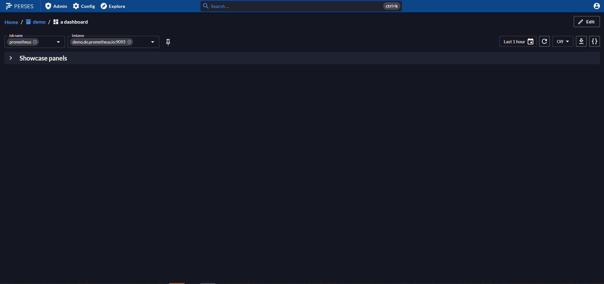
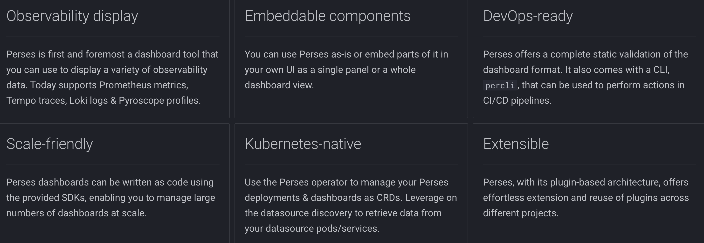
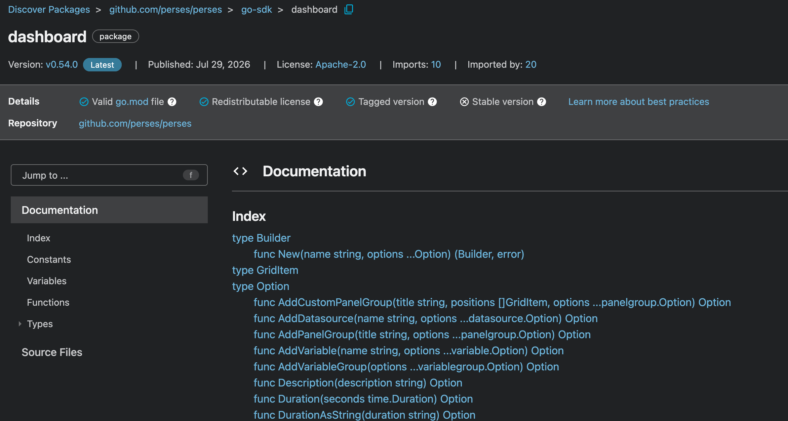
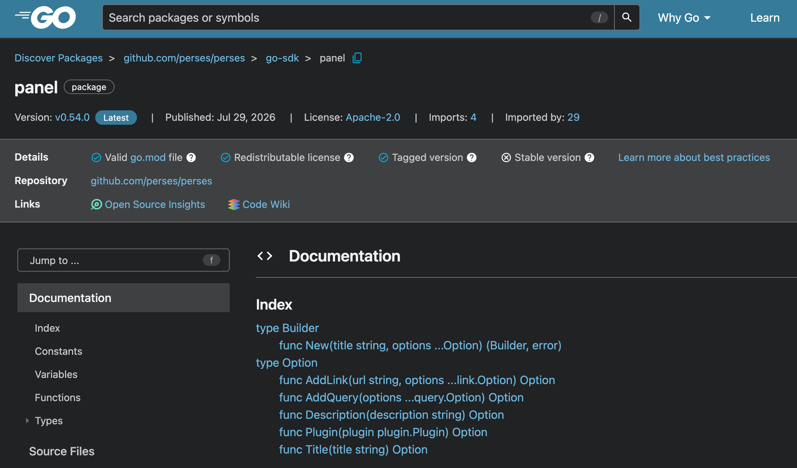
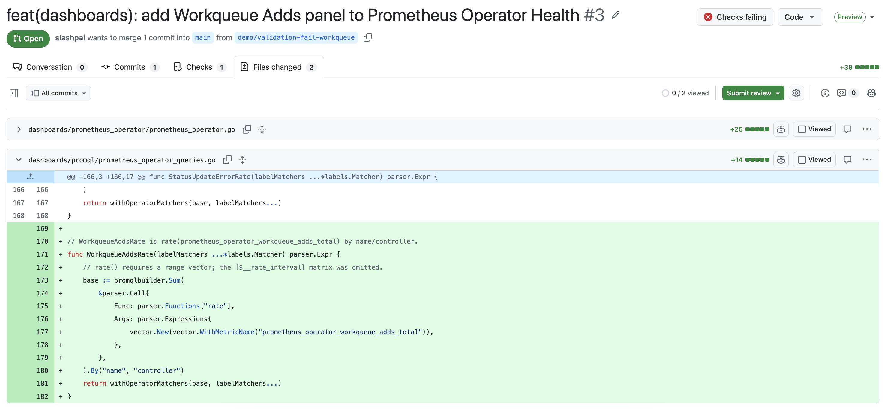
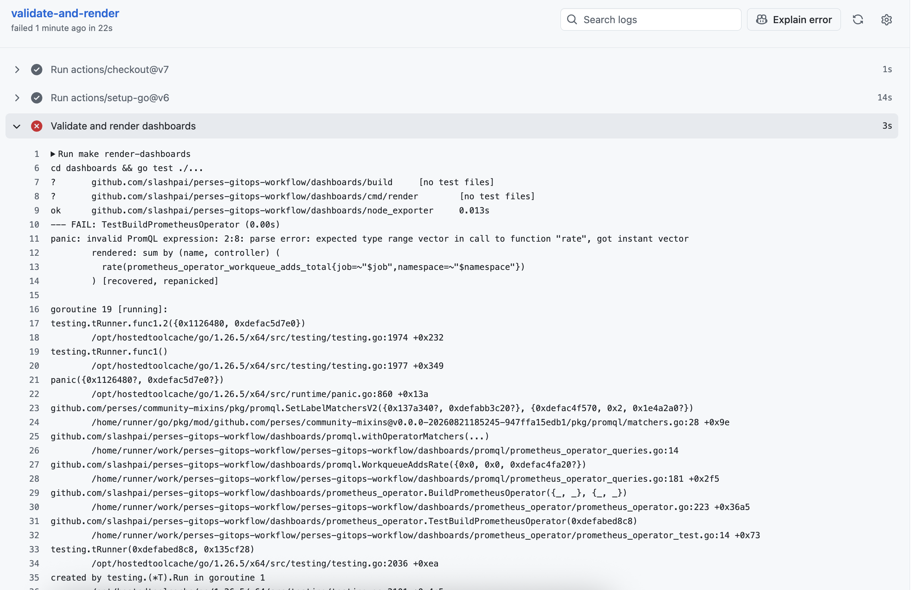
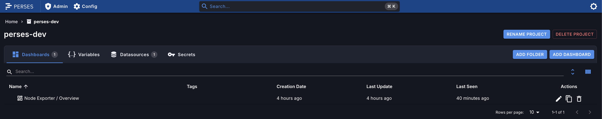
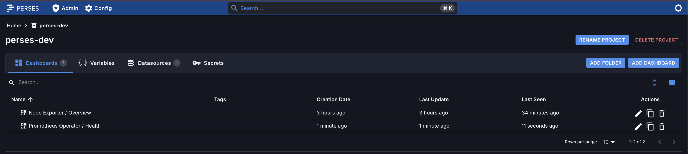
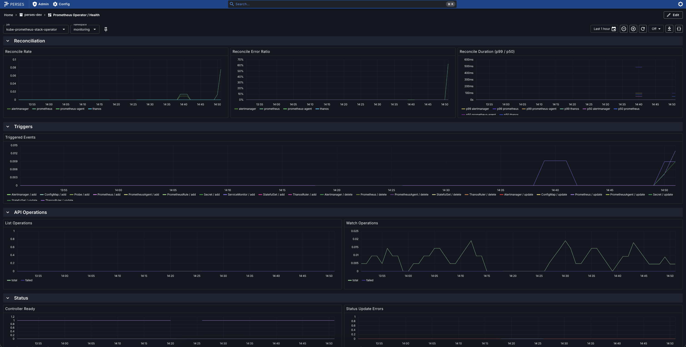
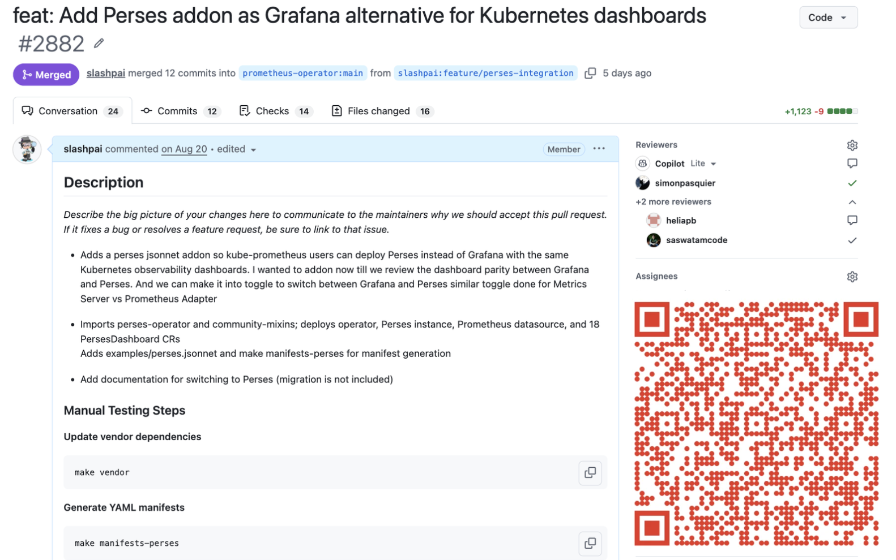

<!-- ===================== ACT 1: CONTEXT ===================== -->

<!-- _paginate: false -->

<div style="display: flex; align-items: center; justify-content: center; gap: 2rem; margin-top: 1em;">


</div>

# Kubernetes Native Observability Dashboards with Perses

### Without the YAML/JSON Hell

<br><br>

**Jayapriya Pai** <!-- right-aligned via scoped style below -->

<style scoped>
h1 { font-size: 32px; }
h3 { color:rgb(200, 53, 33); }
p:last-of-type { text-align: right; color:rgb(70, 63, 193); }
</style>

---

# About me

- Senior Software Engineer at **Red Hat**
- OpenShift In-cluster monitoring
- Maintainer: **prometheus-operator** · **kube-prometheus** · **perses** · **metrics-server**
- Member: **Kubernetes SIG Instrumentation**
- GitHub: [slashpai](https://github.com/slashpai)

<style scoped>
ul li:nth-child(1) strong { color: #EE0000; }
ul li:nth-child(2) strong { color: #EE0000; }
ul li:nth-child(3) strong { color: #1565C0; }
ul li:nth-child(4) strong { color: #1565C0; }
ul li:nth-child(5) a { color: #6A1B9A; }
</style>
---

<!-- _class: small -->


# What is Perses?



<style scoped>
section { font-size: 22px; }
h1 { font-size: 28px; }
</style>

- **CNCF Sandbox** project for observability dashboards
- **Open, vendor-neutral** dashboard & datasource specification
- First class support for **Prometheus** data sources and PromQL
- Author dashboards via **UI**, **Go SDK**, **CUE SDK**, or **Kubernetes CRDs**

---


# Perses at a glance



---

# Multi Datasource: Full Observability Stack

Perses has a **plugin architecture**: Add new datasources without changing core:

- **Metrics**: Prometheus, GreptimeDB
- **Logs**: Loki, OpenSearch, Splunk, VictoriaLogs, ClickHouse
- **Traces**: Tempo, Jaeger
- **Profiling**: Pyroscope
- **Alerts**: Alertmanager

**18+ panel types**: time series, stat, gauge, bar, pie, heatmap, table, flame chart, trace gantt …

<style scoped>
ul li:nth-child(1) strong { color: #E6522C; }
ul li:nth-child(2) strong { color: #1976D2; }
ul li:nth-child(3) strong { color: #7B1FA2; }
ul li:nth-child(4) strong { color: #00897B; }
ul li:nth-child(5) strong { color: #F9A825; }
p:last-of-type { color: #546E7A; }
p:last-of-type strong { color: #1565C0; }
</style>

---

**This talk focuses on Prometheus** (datasource + PromQL).

*UI is great for exploration.*

*But how do you author, validate, and ship dashboards without handwritten YAML/JSON?*

<style scoped>
p:nth-last-of-type(2) em { color: #1565C0; }
p:last-of-type em { color: #4CAF50; }
</style>

---

<!-- ===================== ACT 2: PROBLEM ===================== -->

# A familiar failure mode

**PromQL** lives as an **unvalidated string** in giant JSON.

- Edit PromQL as a **raw string** buried in 1000 lines of JSON
- PR diffs are noise where the PromQL change is buried, so reviewers can miss it
- No CI check: broken PromQL reaches production unchecked
- After deployment: **No Data** from a query that was never validated

---

<!-- ============= ACT 3: VISION + BIG PICTURE =============== -->

# What if dashboards were application code?

<style scoped>
h1 { font-size: 36px; color:rgb(192, 55, 21); }
</style>

---

# Treat them like services you ship every day

- **Authored** in Go
- **Reviewed** as small, meaningful diffs
- **Validated** before merge (structure + PromQL)
- **Delivered** as Kubernetes resources through GitOps or `kubectl apply`

*"YAML is the artifact."*

*"Code is the source of truth."*

<style scoped>
h1 { font-size: 32px; }
ul li:nth-child(1) strong { color: #1565C0; }
ul li:nth-child(2) strong { color: #6A1B9A; }
ul li:nth-child(3) strong { color: #2E7D32; }
ul li:nth-child(4) strong { color: #E65100; }
p:nth-last-of-type(2) em { color: #E65100; }
p:last-of-type em { color: #1565C0; }
</style>

---

<!-- ================ ACT 4: AUTHORING TOOLKIT =============== -->

# The Dashboard-as-Code toolkit

Three Go libraries make this possible:

| Library | Role |
| -------------------------------- | ------------------------------------------------- |
| **Perses Go SDK** | Typed builders for dashboards, panels, queries |
| **promql-builder** | Construct PromQL as a Go AST, not raw strings |
| **community-mixins** | Reusable panel library, import as a Go module |

<style scoped>
tbody tr:nth-child(1) strong { color: #1565C0; }
tbody tr:nth-child(2) strong { color: #6A1B9A; }
tbody tr:nth-child(3) strong { color: #2E7D32; }
</style>

---

<!-- _class: screenshot -->

# Go SDK: Dashboard Builder

The Perses Go SDK builds the dashboard structure: datasources, variables, panels as typed Go.



`dashboard.New`, `AddPanelGroup`, `AddDatasource`, `AddVariable`, `Duration`

<style scoped>
h1 + p { color: #1565C0; font-size: 20px; }
p:last-of-type code:nth-of-type(1) { color: #1565C0; }
p:last-of-type code:nth-of-type(2) { color: #6A1B9A; }
p:last-of-type code:nth-of-type(3) { color: #2E7D32; }
p:last-of-type code:nth-of-type(4) { color: #E65100; }
p:last-of-type code:nth-of-type(5) { color: #00897B; }
</style>

---

<!-- _class: screenshot -->

# Go SDK: Panel Builder



`panel.New`, `AddQuery`, `Description`, `Plugin`, `Title`

[pkg.go.dev/github.com/perses/perses/go-sdk](https://pkg.go.dev/github.com/perses/perses/go-sdk)

<style scoped>
p:nth-last-of-type(2) code:nth-of-type(1) { color: #1565C0; }
p:nth-last-of-type(2) code:nth-of-type(2) { color: #6A1B9A; }
p:nth-last-of-type(2) code:nth-of-type(3) { color: #2E7D32; }
p:nth-last-of-type(2) code:nth-of-type(4) { color: #E65100; }
p:nth-last-of-type(2) code:nth-of-type(5) { color: #00897B; }
</style>

---

# How a dashboard is composed

Each layer is a **typed Go function**: compose, review, and validate like application code.

<pre><code><b>dashboard.New("node-exporter-overview", …)</b>
 └── <em>dashboard.AddPanelGroup("CPU (community-mixins)",</em>
      └── <u>panelgroup.AddPanel("CPU Usage",</u>   <i>// NodeCPUUsagePercentage</i>
           ├── <mark>panel.Description("Shows CPU utilization percentage…")</mark>
           ├── <mark>timeSeriesPanel.Chart(...)</mark>
           └── <strong>panel.AddQuery(query.PromQL(
                 promql.SetLabelMatchersV2(
                   NodeExporterCommonPanelQueries["NodeExporterCPUUsagePercentage"],
                   labelMatchers,
                 ).Pretty(0), ...))</strong>
</code></pre>

<style scoped>
code { font-size: 14px; }
h1 + p { color: #1565C0; }
h1 + p strong { color: #2E7D32; }
pre b { color: #1565C0; font-weight: 700; }
pre i { color: #6A1B9A; font-style: normal; }
pre em { color: #2E7D32; font-style: normal; font-weight: 600; }
pre u { color: #E65100; text-decoration: none; font-weight: 600; }
pre mark { color: #00897B; background: transparent; }
pre strong { color: #C62828; font-weight: 600; }
</style>

---

# What is a Mixin

A **Mixin** is a reusable package of dashboards, alerts, and recording rules for a specific component.

**Traditionally:**

- Written in **Jsonnet** → generates JSON dashboards + PrometheusRule YAML
- **Examples:** `kubernetes-mixin`, `node-exporter-mixin`, `etcd-mixin`
- In practice many teams skip Jsonnet, fetch the **rendered YAML**, and patch with Kustomize and reuse never sticks

<style scoped>
ul li:nth-child(1) strong { color: #C62828; }
ul li:nth-child(2) strong { color: #546E7A; }
ul li:nth-child(2) code:nth-of-type(1) { color: #1565C0; }
ul li:nth-child(2) code:nth-of-type(2) { color: #6A1B9A; }
ul li:nth-child(2) code:nth-of-type(3) { color: #2E7D32; }
ul li:nth-child(3) strong { color: #E65100; }
</style>

---

# Perses community-mixins: mixins, but in Go

Goal is **not** only ready-made YAML, it's a **panel library** you import and compose.

- Dashboards built with the **Perses Go SDK**
- Reusable **panels**: import what you need, extend with your own
- Same patterns → **consistency** across teams and services
- Customize label matchers for your environment via **Go functions**

`go get github.com/perses/community-mixins`, then import panels like any Go module.

<style scoped>
h1 + p strong { color: #2E7D32; }
ul li:nth-child(1) strong { color: #1565C0; }
ul li:nth-child(2) strong { color: #6A1B9A; }
ul li:nth-child(3) strong { color: #2E7D32; }
ul li:nth-child(4) strong { color: #E65100; }
p:last-of-type { color: #546E7A; }
p:last-of-type code { color: #2E7D32; font-weight: 600; }
</style>

---
<!-- =============== ACT 5: CODE DEEP-DIVE =================== -->

# Compose and extend community-mixins

<pre><code><b>import (
    communityPanels "github.com/perses/community-mixins/pkg/panels/node_exporter"
    mixinpromql     "github.com/perses/community-mixins/pkg/promql"
    gitpromql       "github.com/slashpai/perses-gitops-workflow/dashboards/promql"
)</b>

communityPanels.SetNodeExporterLabelValue("node-exporter")
jobMatcher := &labels.Matcher{Name: "job", Type: labels.MatchEqual,
    Value: communityPanels.GetNodeExporterLabelValue()}
instanceMatcher := mixinpromql.InstanceVarV2

// Reuse community panels with kube-prometheus matchers
<em>dashboard.AddPanelGroup("CPU (community-mixins)",
    communityPanels.NodeCPUUsagePercentage(datasource, jobMatcher, instanceMatcher),
    communityPanels.NodeAverage(datasource, jobMatcher, instanceMatcher),
),
dashboard.AddPanelGroup("Memory (community-mixins)",
    communityPanels.NodeMemoryUsageBytes(datasource, jobMatcher, instanceMatcher),
    communityPanels.NodeMemoryUsagePercentage(datasource, jobMatcher, instanceMatcher),
),</em>

// Extend with your own panel alongside
<strong>dashboard.AddPanelGroup("Filesystem (custom)",
    panelgroup.AddPanel("Filesystem Used",
        panel.AddQuery(
            query.PromQL(gitpromql.FilesystemUsedRatio().Pretty(0), ...),
        ),
    ),
),</strong>
</code></pre>

<style scoped>
pre { font-size: 13px; }
pre b { color: #1565C0; }
pre em { color: #2E7D32; font-style: normal; }
pre strong { color: #E65100; font-weight: 600; }
</style>

---

# Dashboard built from scratch

No community-mixins panels? Build the whole dashboard from your own queries:

<pre><code><b>import (
    gitpromql "github.com/slashpai/perses-gitops-workflow/dashboards/promql"
)</b>

<b>dashboard.New("prometheus-operator-health",
    dashboard.Name("Prometheus Operator / Health"),
    dashboard.AddVariable("job", ...),       // Helm job names vary
    dashboard.AddVariable("namespace", ...),</b>

    <em>dashboard.AddPanelGroup("Reconciliation",
        panelgroup.AddPanel("Reconcile Rate",
            query.PromQL(gitpromql.ReconcileRate().Pretty(0), ...)),
        panelgroup.AddPanel("Reconcile Error Ratio",
            query.PromQL(gitpromql.ReconcileErrorRatio().Pretty(0), ...)),
        panelgroup.AddPanel("Reconcile Duration (p99 / p50)", ...),
    ),</em>
    <i>dashboard.AddPanelGroup("Triggers", ...),
    dashboard.AddPanelGroup("API Operations", ...),
    dashboard.AddPanelGroup("Status", ...),</i>
)
</code></pre>

**same SDK**, **same CI**, **same GitOps** but local PromQL helpers not community imports.

<style scoped>
pre { font-size: 15px; }
pre b { color: #1565C0; }
pre em { color: #2E7D32; font-style: normal; }
pre i { color: #6A1B9A; font-style: normal; }
p:last-of-type { color: #546E7A; }
p:last-of-type strong:nth-of-type(1) { color: #1565C0; }
p:last-of-type strong:nth-of-type(2) { color: #6A1B9A; }
p:last-of-type strong:nth-of-type(3) { color: #E65100; }
</style>

---

<!-- =============== ACT 6: PROMQL SAFETY ==================== -->

# PromQL as an AST (not a fragile string)

Queries inside those panels use **promql-builder**: PromQL as a Go AST, not a raw string.

<pre><code><i>// ReconcileRate — prometheus-operator metrics</i>
<b>promqlbuilder.Sum(
    promqlbuilder.Rate(</b>
        <em>matrix.New(
            vector.New(vector.WithMetricName(
                <strong>"prometheus_operator_reconcile_operations_total"</strong>)),
            matrix.WithRangeAsVariable("$__rate_interval"),
        ),</em>
    <b>),
).By("controller", "namespace")</b>
<i>// then withOperatorMatchers → job=~"$job", namespace=~"$namespace"</i>
</code></pre>

<pre><code><i>// FilesystemUsedRatio — custom extend panel (dashboards/promql/queries.go)</i>
<b>promqlbuilder.Div(
    promqlbuilder.Sub(</b>
        <em>vector.New(vector.WithMetricName(<strong>"node_filesystem_size_bytes"</strong>),
            vector.WithLabelMatchers(fstype!="", mountpoint!="")),
        vector.New(vector.WithMetricName(<strong>"node_filesystem_avail_bytes"</strong>),
            vector.WithLabelMatchers(fstype!="", mountpoint!="")),</em>
    <b>),</b>
    <em>vector.New(vector.WithMetricName(<strong>"node_filesystem_size_bytes"</strong>), ...),</em>
<b>)</b>
<i>// then withNodeMatchers → job="node-exporter", instance=~"$instance"</i>
</code></pre>

**promql-builder** → construct queries as typed Go AST, **validate at build / CI time**.

<style scoped>
h1 + p { color: #6A1B9A; font-size: 20px; }
h1 + p strong { color: #1565C0; }
pre { font-size: 14px; }
pre i { color: #78909C; font-style: italic; }
pre b { color: #1565C0; font-weight: 600; }
pre em { color: #6A1B9A; font-style: normal; }
pre strong { color: #E65100; font-weight: 600; }
p:last-of-type strong:nth-of-type(1) { color: #1565C0; }
p:last-of-type strong:nth-of-type(2) { color: #2E7D32; }
</style>

---

# PromQL validated before it ships

From [community-mixins](https://github.com/perses/community-mixins) `pkg/promql` used by demo and mixin panels:

<pre><code><b>func SetLabelMatchersV2</b>(query parser.Expr, matchers []*labels.Matcher) parser.Expr {
    copy := <em>promqlbuilder.DeepCopyExpr</em>(query)
    for _, l := range matchers {
        copy = labelsSetPromQLV2(copy, l.Type, l.Name, l.Value)
    }
    if err := <strong>promqlbuilder.Validate(copy)</strong>; err != nil {
        panic(err)   <i>// bad PromQL never renders</i>
    }
    return copy
}
</code></pre>

Every query passes through `promqlbuilder.Validate`: malformed PromQL is caught **before** YAML is generated.

`go test ./...` → validate all dashboards → render CRs → commit.

<style scoped>
h1 + p { color: #546E7A; font-size: 20px; }
h1 + p a { color: #2E7D32; }
pre { font-size: 16px; }
pre b { color: #1565C0; font-weight: 600; }
pre em { color: #6A1B9A; font-style: normal; }
pre strong { color: #C62828; font-weight: 700; }
pre i { color: #78909C; font-style: italic; }
pre + p { color: #1565C0; }
pre + p code { color: #6A1B9A; }
pre + p strong { color: #C62828; }
</style>

---

<!-- _class: screenshot -->

# CI catches bad PromQL before merge

PR adds a Workqueue panel: **checks failing**



<style scoped>
h1 + p { color: #546E7A; }
h1 + p strong { color: #C62828; }
</style>

---

<!-- _class: screenshot -->

# `promqlbuilder.Validate` in CI

`rate()` needs a **range vector** missing `[$__rate_interval]`



<style scoped>
h1 + p { color: #546E7A; }
h1 + p code { color: #6A1B9A; }
h1 + p strong { color: #C62828; }
</style>

---

<!-- ========== ACT 7: DELIVERY — OPERATOR + GITOPS ========== -->

# Dashboards are validated. How do they reach the cluster now?

<style scoped>
h1 { font-size: 28px; color:rgb(192, 49, 21); }
</style>

---

# Perses Operator


Kubernetes-native dashboard & datasource lifecycle via **CRDs**:

| CRD | Role |
| --- | --- |
| `Perses` | Server instance (Deploy/STS, Service) |
| `PersesDashboard` | Dashboard → Perses project (namespace) |
| `PersesDatasource` | Project-scoped datasource |
| `PersesGlobalDatasource` | Cluster-scoped datasource |

The controller syncs valid CRs to Perses and reports **status** back.

<style scoped>
h1 + p { color: #1565C0; }
h1 + p strong { color: #E65100; }
p:last-of-type { color: #1565C0; }
p:last-of-type strong { color: #2E7D32; }
</style>

---

# What you ship → Generated PersesDashboard YAML

```yaml
apiVersion: perses.dev/v1alpha2
kind: PersesDashboard
metadata:
  name: node-exporter-overview
  namespace: perses-dev
spec:
  config:
    display:
      name: Node Exporter / Overview
    panels:
      # … generated from Go — not hand-edited …
```

- Built with the **Perses Go SDK**
- Queries via **promql-builder**
- Rendered to a **PersesDashboard** CR

**Don't hand-edit this YAML.**

<style scoped>
ul li:nth-child(1) strong { color: #1565C0; }
ul li:nth-child(2) strong { color: #6A1B9A; }
ul li:nth-child(3) strong { color: #E65100; }
p:last-of-type { color: #C62828; }
p:last-of-type strong { color: #C62828; }
</style>

---

# End-to-end flow

```text
  dashboards/ (Go)
       │  make validate-dashboards   ← go test ./...
       │  make render-dashboards     ← go run ./cmd/render
       ▼
  manifests/dashboards/
    ├── node-exporter-overview.yaml
    └── prometheus-operator-health.yaml
       │  PR + CI drift check
       ▼
  Argo CD  →  perses-operator  →  Perses UI
```

**Demo repo:** [slashpai/perses-gitops-workflow](https://github.com/slashpai/perses-gitops-workflow)

---

<!-- =============== ACT 8: VISUAL PROOF ===================== -->

<!-- _class: screenshot -->

# GitOps: Argo CD Application

`perses-dashboards` · `manifests/dashboards` → `perses-dev` · Healthy / Synced


---

<!-- _class: screenshot -->

# Perses Operator reconciles the CR

Resource tree: `PersesDashboard` / `node-exporter-overview`


---

<!-- _class: screenshot -->

# Perses UI after first sync

Node Exporter / Overview



---

<!-- _class: screenshot -->

# Evolve via PR → new dashboard lands

Add Prometheus Operator / Health in Go → validate → render → merge → both CRs sync


---

<!-- _class: screenshot -->

# Perses UI after second sync

**Overview** + **Prometheus Operator / Health**: same GitOps pipeline, two authoring patterns



<style scoped>
h1 + p { color: #546E7A; }
h1 + p strong:nth-of-type(1) { color: #2E7D32; }
h1 + p strong:nth-of-type(2) { color: #E65100; }
</style>

---

<!-- _class: screenshot -->

# What you see in Perses

**Node Exporter / Overview**: **community-mixins** + **custom Filesystem** panel, validated PromQL from Go


<style scoped>
h1 + p { color: #546E7A; }
h1 + p strong:nth-of-type(1) { color: #1565C0; }
h1 + p strong:nth-of-type(2) { color: #2E7D32; }
h1 + p strong:nth-of-type(3) { color: #E65100; }
</style>

---

<!-- _class: screenshot -->

# What you see in Perses

**Prometheus Operator / Health**: dashboard built **from scratch**



<style scoped>
h1 + p { color: #546E7A; }
h1 + p strong:nth-of-type(1) { color: #E65100; }
h1 + p strong:nth-of-type(2) { color: #1565C0; }
</style>

---

<!-- =================== ACT 9: CLOSE ======================== -->

# Validation layers

| When           | What                     | Tool                                     |
| -------------- | ------------------------ | ---------------------------------------- |
| **Build / CI** | Bad PromQL structure     | `promqlbuilder.Validate`                 |
| **Build / CI** | Manifest drift           | `git diff --exit-code manifests/dashboards/` |
| **Deploy**     | Invalid dashboard spec   | Operator → Perses API validation         |

<style scoped>
tbody tr:nth-child(1) strong { color: #1565C0; }
tbody tr:nth-child(1) code { color: #6A1B9A; }
tbody tr:nth-child(2) strong { color: #1565C0; }
tbody tr:nth-child(2) code { color: #E65100; }
tbody tr:nth-child(3) strong { color: #2E7D32; }
</style>

---

# Takeaways

1. **Stop rebuilding the same dashboards**: import a panel library, compose and extend
2. **Dashboards like app code**: reviewed, validated in CI, delivered via GitOps
3. **Kubernetes-native**: CRDs + operator manage lifecycle, not import scripts
4. **Two patterns**: compose/extend community-mixins when panels exist; from scratch when they don't

YAML is how you ship. **Go is how you author.**

<style scoped>
p:last-of-type { color: #E65100; }
p:last-of-type strong { color: #1565C0; }
</style>

---

# Perses now ships as an addon in kube-prometheus

<style scoped>
h1 { font-size: 28px; color: rgb(192, 49, 21); }
</style>



- Perses deployed **out of the box** alongside Prometheus, Alertmanager, and other kube-prometheus components
- **23 community-mixins dashboards** deployed as PersesDashboard CRs

<style scoped>
ul li:nth-child(1) strong { color: #2E7D32; }
ul li:nth-child(2) strong { color: #E65100; }
ul li:nth-child(3) strong { color: #1565C0; }
</style>

---

# Try it / go deeper


- Live demo: [demo.perses.dev](https://demo.perses.dev/)
- Demo repo: [slashpai/perses-gitops-workflow](https://github.com/slashpai/perses-gitops-workflow)
- Try with kube-prometheus: [Perses addon docs](https://github.com/prometheus-operator/kube-prometheus/blob/main/docs/customizations/perses.md)
- [perses/perses](https://github.com/perses/perses) · [perses-operator](https://github.com/perses/perses-operator) · [spec](https://github.com/perses/spec)
- [promql-builder](https://github.com/perses/promql-builder) · [community-mixins](https://github.com/perses/community-mixins)
- Blog: [Composable Dashboards](https://perses.dev/blog/2025/06/10/composable-dashboards----lessons-from-building-perses-community-dashboards/)

---

# Interested in contributing or want to know more?

Perses is a **CNCF Sandbox** project: contributions are welcome!

- Slack: **#perses-dev** on [CNCF Slack](https://slack.cncf.io/)
- Contact: [perses.dev/perses/docs/contact](https://perses.dev/perses/docs/contact/)
- GitHub Discussions: [perses/perses](https://github.com/perses/perses/discussions)

<style scoped>
h1 + p strong { color: #1565C0; }
ul li:nth-child(1) strong { color: #E65100; }
ul li:nth-child(1) a { color: #6A1B9A; }
ul li:nth-child(2) a { color: #1565C0; }
ul li:nth-child(3) a { color: #2E7D32; }
</style>

---

# Scan to explore Perses


<div style="text-align: center;">

</div>

---

# Thank you!

### Questions?

<style scoped>
h3 { color: #1565C0; }
</style>
